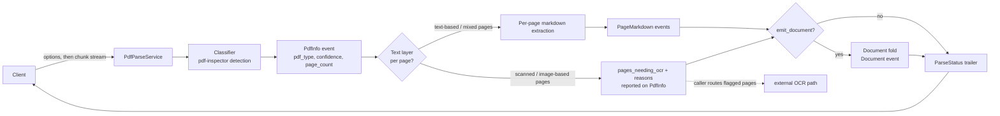

# grpc-pdf-inspector

A gRPC server that classifies PDFs in memory and streams per-page markdown
back. It wraps firecrawl's MIT-licensed
[`pdf-inspector`](https://crates.io/crates/pdf-inspector) crate (default
features only: pure Rust, lopdf + rayon, no models) behind the ai-pipestream
fleet's collector conventions.

The crate is vendored under `vendor/pdf-inspector` and patched there, because
five things this service must capture are computed inside it and returned by
none of its public API: the invisible text layer, the per-page garble score,
the vector rectangles and line segments the ruled-table detectors run on, the
column detector, and the header, footer and folio stripper's own verdicts. `vendor/pdf-inspector/README.md` names each patch and
`docs/capture-deferrals.md` records the commit that made it.

It is the fleet's cheap routing answer for PDF:

- **Text-based** PDFs carry a real text layer. Classification says so in
  ~10–50ms and the markdown streams out page by page.
- **Scanned / image-based** PDFs have no usable text layer. Classification
  says so, `pages_needing_ocr` names the pages, and the caller routes only
  those to a heavy OCR path (e.g. gRParse's ONNX engines). This server never
  OCRs.
- **Mixed** PDFs get both: text pages stream, the rest are reported.

Every page is judged on its own content, so a scanned page inside a
text-based document is named too, sampled or not. A scan made searchable
(an OCRmyPDF, ABBYY or Acrobat page image with an invisible OCR layer
behind it) is mixed: every page is named as needing OCR, because no reader
sees that text, and in FULL mode each page's markdown is its OCR layer, as
the parser's own OCR-layer fallback reads it, so a caller without OCR still
gets the words.

Nothing is written to disk at any point: the upload lives in one `Vec<u8>`
and every library call is a `*_mem` entry point.



## The stream

`ParsePdf` is a bidirectional stream. The first request frame carries
`options`; the rest carry `chunk`s of PDF bytes. The upload is fully received
before the first event — a PDF's cross-reference table is at the end of the
file, so no page is locatable until the last byte has arrived — and streaming
begins the moment it is possible:

```text
info      always first: pdf_type, confidence, page_count, title,
          pages_needing_ocr + reasons, detection_time_ms
metadata  only with options.emit_metadata: what the file says about
          itself, immediately after info
structure only with options.emit_structure: one per page, the authored
          tagged-PDF roles, before that page's other events
tables    only with options.emit_tables: one per page that has tables,
          the detected grids with their coordinates
spans     only with options.emit_spans: one per page, the positioned text
          runs the markdown was rendered from
page      FULL mode, text-bearing documents only: one per page,
          1-indexed, in requested page order
document  only when options.emit_document is set: the whole parse folded
          into one ai.pipestream.document.v1.Document, after the last
          page, before status
status    trailer: pages_extracted, warnings, layout complexity,
          has_encoding_issues, has_invisible_text, per-page extraction OCR
          reasons, total processing_time_ms
```

Modes (`options.mode`): `DETECT_ONLY` (classification only, the ~10–50ms
routing answer), `ANALYZE` (classification + layout/encoding analysis, no
markdown), `FULL` (classification + per-page markdown; the default).

Every event class above `page` is off by default and costs nothing when
off. `emit_metadata` and `emit_structure` each cost one more read of the
file; `emit_spans` and `emit_tables` cost only the bandwidth of sending
what the extraction pass already produced. `report_furniture` reports a
page's chrome (the running head, the footer, the folio, the numbers ruled
down the margin), which the strippers remove and used to remove silently,
and reports separately, on `dropped`, the runs the rendering left out,
which are content rather than chrome and go back into the body. It also
keeps that chrome out of `markdown`: the verdict is taken before the page
is rendered and the convicted runs never reach the renderer, so a margin
line number cannot fuse into the sentence it stands beside.
`report_invisible` reports the runs a page drew with rendering mode 3, which
paint no glyphs at all: it costs a second walk of the content streams, and
only for a document whose first walk found an invisible layer to walk.

A FULL call reads the document twice: once to classify it, once to extract
it. Everything else the mode reports comes off the runs that second read
returns, including the markdown, the tables, the layout verdict, the
per-page OCR verdicts and the garble score.
`grpc-pdf-inspector metrics parser_passes=` counts the reads, and
`tests/passes.rs` holds them to those numbers.

### What the events carry beyond markdown

- **`spans`** — every positioned run: text, box in PDF points, font family
  and resource tag, size, bold/italic/underline/strikeout, the
  marked-content id, and the target of a link annotation. This is the
  lossless half of a FULL stream and the only place a coordinate appears.
- **`structure`** — the roles a tagged document gives its own content
  (`H1`–`H6`, `P`, `L`, `LI`, `Table`, `Figure`, `Caption`, `Code`, …),
  resolved through `/RoleMap` and joined to the runs by marked-content id.
  An authored heading beats a heading level guessed from type size.
- **`tables`** — the detected grids: column and row positions in page
  points, the cells, and whether the detector read data or a table of
  contents. Three detectors run in the order the library runs them: the
  rules a table drew are asked first, then its line segments, and only a
  table with no rules at all falls through to inferring columns from
  alignment.
- **`page.invisible`** — with `report_invisible` set, the runs the page drew
  with text rendering mode 3, each with its box. They are not in the
  markdown, because no reader saw them, except on a scanned page with no
  visible text at all, whose OCR layer is its markdown and whose
  `needs_ocr` is set.
- **`page.garble_score`** — how far the page's letter frequencies sit from
  where a Latin-script language puts them, 0.0 for ordinary prose and
  rising towards 1.0 for a text layer whose CMap substituted every
  character. Absent for a page with too few letters to measure.
- **`metadata`** — the information dictionary in full, the XMP packet, the
  file-format version, the catalog language, the tagged flag, the file
  identifier, the encryption posture, the outline, embedded file
  attachments, per-page boxes, rotation and page labels, named
  destinations, the trapping declaration, and every link annotation with
  its destination resolved.

### The optional Document projection

With `options.emit_document` set, the server additionally folds its own
event stream into one `ai.pipestream.document.v1.Document` (the schema is
vendored byte-identical from gRParse) and sends it as a `document` event
after the last `page` and before `status`. The event stream stays the
primary, lossless wire; the Document is a coarse, self-contained
projection of it that a coordinator can merge additively with another
collector's parse of the same document:

- Headings come from the document's own tagging when it is tagged, and
  from the markdown's ATX levels when it is not. Lists become `ListItem`s
  inside a list `GroupItem`, fenced blocks become `CodeItem`s, and a
  detected table becomes a `TableItem` with typed cells rather than pipe
  characters inside a paragraph. The grids and the pipe blocks come from
  different detectors, so a pipe block takes the grid on its page that sits
  where it sits (or, when its runs could not be located, whose cells it
  carries); a grid no block matches stays on the `tables` event, and a
  block no grid matches stays as the renderer printed it.
- Every item carries a `ProvenanceItem` naming its page, with a bounding
  box whenever the page's runs could be located behind the item's text.
  `PageItem.unit` says those boxes are in points, and `PageItem.size`
  carries the page's own visible box when the metadata pass read one.
- `source_meta`, `outline`, `attachments` and `anchors` come from the
  file's own dictionaries, down to the format version, the tagged flag,
  the authoring application, the encryption posture, the XMP packet and
  the file's own `/ID`. Link annotations become `InlineSpan.hyperlink`
  over the anchored words, internal cross-references become
  `InlineSpan.target` pointing at the page they lead to, and a link over a
  figure becomes that `PictureItem`'s `hyperlink` when it leads out of the
  document or its `target` when it leads back into one.
- Bold, italic, underline and strikeout become `InlineSpan.formatting`
  over the characters they actually cover, with the face and type size
  beside them, instead of `**` and `<u>` inside the text.
- Every image the page drew becomes a `PictureItem` with the box the
  content stream placed it at.
- A page's chrome goes into the furniture group under
  `CONTENT_LAYER_FURNITURE` when `report_furniture` is set, and runs the
  page drew invisibly go into the same group under
  `CONTENT_LAYER_INVISIBLE`, with their boxes. A hidden watermark is an
  item a coordinator can act on rather than text nobody was told about.
  Runs the markdown renderer left out are not chrome: they are folded back
  into the body at the place the page drew them.
- `PageItem.quality` carries what the reading pass measured about a page:
  the replacement-character runs, the garble score, and the OCR
  recommendation when there is one.
- Every item's `CollectorSource` is `collector: "pdf"`,
  `model: "pdf-inspector <crate version>"`, `version: <this build's
  version>`, `confidence: <the detection confidence from info>`.
- Item refs are dense and local (`#/texts/0`), and the fragment is flat:
  every item's parent is `#/body` or a group, never another text item, so
  a consumer walking `#/body` through its groups reaches every body item
  and refs renumber mechanically on merge. A section header carries its
  depth on `level` rather than by owning the prose beneath it. An item's
  layer and the group it hangs under always agree: `CONTENT_LAYER_BODY`
  hangs under `#/body`, everything else under `#/furniture`, so the body
  walk reaches exactly the body.
- Default off costs nothing: no fold is built and no markdown is
  retained.

Errors: oversize upload, or a document that inflates past its
decompression limits → `RESOURCE_EXHAUSTED`; not-a-PDF / truncated /
malformed / encrypted-without-password / a page selection with no usable
page → `INVALID_ARGUMENT`; a
call that holds its parse slot past `GRPC_PDF_MAX_PARSE_SECONDS`, an
upload still arriving after `GRPC_PDF_MAX_UPLOAD_SECONDS`, or an upload
that sends no bytes for 30 seconds (empty chunks are not bytes) →
`DEADLINE_EXCEEDED`; parser panic → `INTERNAL`. Events already delivered
before a failure remain valid. Every parser pass runs under those limits:
each stream is decoded against the per-stream cap and the read's budget,
and the parse checks its deadline, and whether its caller is still there,
between pages, so a hung-up or overdue call gives its slot back within a
page rather than at the end of the document.

Passwords: supply `options.password` for an encrypted PDF. The library's
per-page extraction API takes no password, so FULL mode with a password
falls back to whole-document extraction — one `page` event with `page_no` 0
plus a `PARSE_WARNING_CODE_PASSWORD_FALLBACK` warning.

Page indexing: the wire is 1-indexed everywhere. The library's per-page
extraction API is 0-indexed; the conversion lives in `src/parse.rs`, at the
library boundary, and nowhere else.

Page selection: `options.pages` lists pages, each processed once in the
order first listed; a listed page past the end is left out and the trailer
says so with `PARSE_WARNING_CODE_PAGES_OUT_OF_RANGE`. `options.first_page`
and `options.last_page` select an inclusive span instead, clamped to the
document, so "page 5 to the end" is `first_page: 5`. A selection that
names page 0, sets both forms, runs backwards, or leaves no page of the
document selected is `INVALID_ARGUMENT`, before any event is sent.

## Run

```sh
cargo run --release
# or
docker build -t grpc-pdf-inspector .
docker run --rm --read-only --cap-drop ALL --security-opt no-new-privileges \
  -p 50067:50067 grpc-pdf-inspector
```

Configuration is environment-only:

| Variable | Default | Meaning |
|---|---|---|
| `GRPC_PDF_ADDR` | `0.0.0.0:50067` | Listen address. |
| `GRPC_PDF_MAX_BYTES` | `134217728` (128 MiB) | Largest accepted upload. |
| `GRPC_PDF_MAX_CHUNK_BYTES` | `16777216` (16 MiB) | Largest single `chunk` frame. |
| `GRPC_PDF_MAX_CONCURRENT_PARSES` | `8` | Concurrent calls, uploading or parsing; further calls wait, before their upload is read. |
| `GRPC_PDF_MAX_STREAM_BYTES` | `268435456` (256 MiB) | Largest size any one stream of a document may decompress to. |
| `GRPC_PDF_MAX_DECOMPRESSED_BYTES` | `4294967296` (4 GiB) | Largest total one read of a document may decompress to. |
| `GRPC_PDF_MAX_PARSE_SECONDS` | `300` | Longest a call may hold its parse slot, upload included. At most `86400` (a day), or the server refuses to start. |
| `GRPC_PDF_MAX_UPLOAD_SECONDS` | `60` | Longest a call's upload may take once it holds its slot; it also spends the parse budget. Must be a whole number of seconds from 1 to `86400`, or the server refuses to start. |
| `GRPC_PDF_WORKERS` | CPU count | Tokio worker threads. |
| `GRPC_PDF_WINDOW_BYTES` | `4194304` | HTTP/2 initial window (stream and connection). |
| `GRPC_PDF_METRICS_INTERVAL_SECS` | `60` | Seconds between metrics lines; 0 disables. |

The server also registers `grpc.health.v1.Health` and v1 server reflection
(with the health descriptor included, so `grpcurl` can probe it):

```sh
grpcurl -plaintext localhost:50067 list
grpcurl -plaintext localhost:50067 grpc.health.v1.Health/Check
```

## Web demo

`demos/node-client` is a dependency-light Node viewer: it POSTs a PDF and
reads the parse events back off the same HTTP response, so the page shows
the classification arriving first (with its millisecond cost) and the page
markdown streaming behind it.

```sh
cd demos/node-client && npm install && npm start
# open http://127.0.0.1:8093  (PDF_ADDR, PORT, UI_BASE overridable)
```

## Develop

```sh
cargo test          # the suite, incl. the stream-liveness tests
cargo clippy --all-targets -- -Dwarnings
cargo fmt --check
```

Protobuf codegen is dev-time only (no `build.rs`, no protoc):

```sh
cargo install protoc-gen-prost protoc-gen-tonic   # once
buf lint && buf generate && buf build -o src/gen/file_descriptor_set.binpb
```

The generated Rust and the descriptor set are checked in under `src/gen/`;
regenerate after any change under `proto/`. Tests author every PDF fixture in
memory with lopdf; nothing binary is committed.

## License

Apache-2.0 (this repo). The vendored `pdf-inspector` crate under
`vendor/pdf-inspector` is MIT, and keeps its own LICENSE file.
